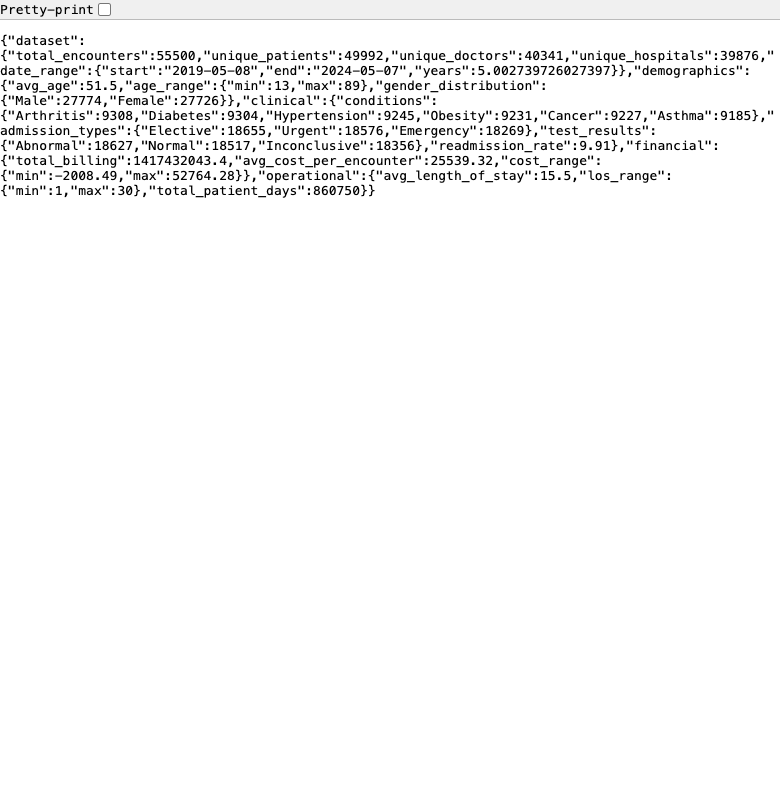
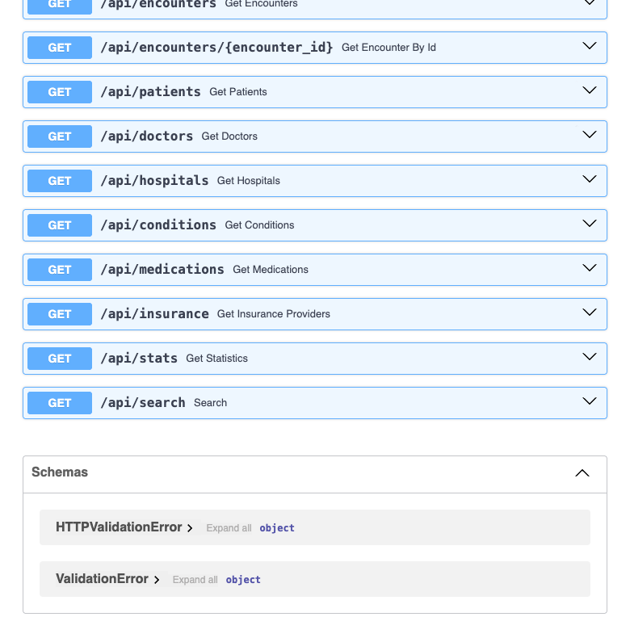
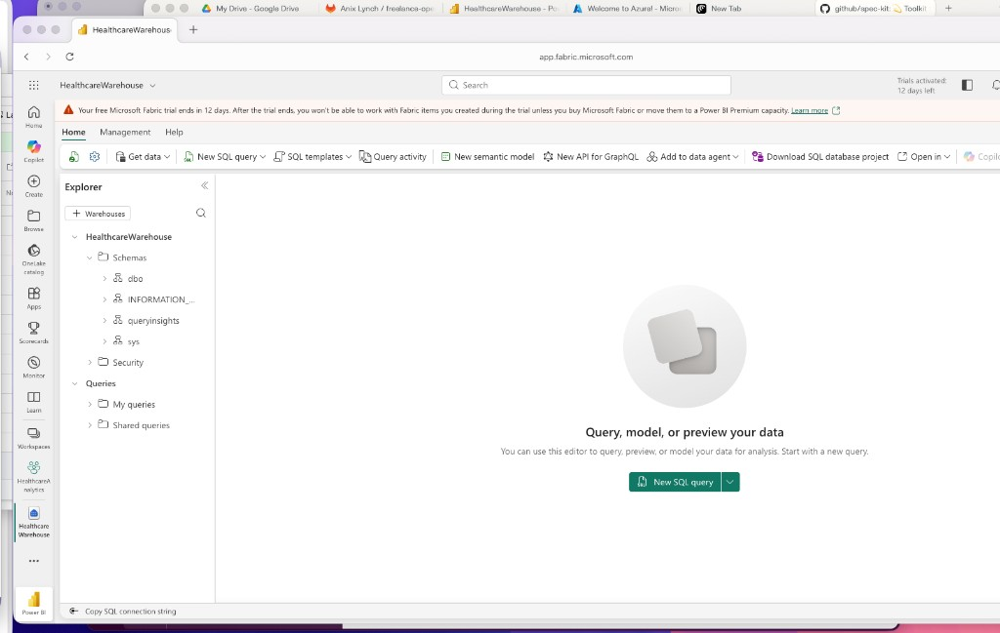
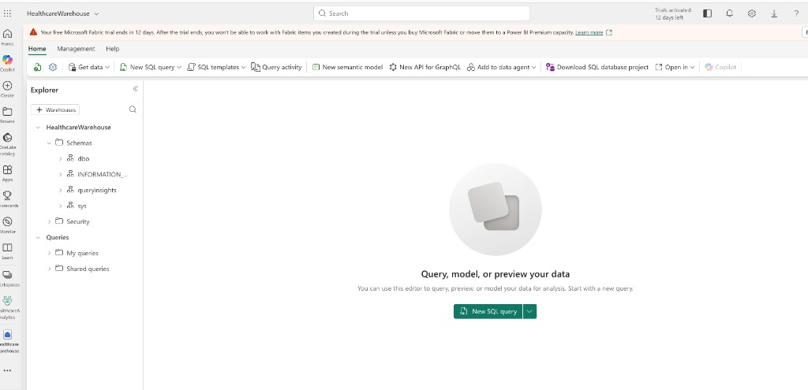

# Healthcare Analytics Portfolio

End-to-end healthcare data analytics stack demonstrating API development, data warehousing, semantic modeling, and machine learning on 55,500 synthetic patient encounters.

## Project Overview

This portfolio showcases a production-ready healthcare analytics pipeline built with modern data engineering tools:

- **FastAPI** service with 11 REST endpoints for encounter data access
- **dbt** star-schema data warehouse with 8 core marts and 3 SQL quality checks
- **Power BI** semantic model (TMDL/DAX) with version-controlled measures
- **XGBoost + MLflow** readmission risk model with experiment tracking

## Repository Structure

```
├── api/              # FastAPI service (11 GET endpoints)
├── dbt/              # dbt project (star schema, 8 marts, 3 tests)
├── ml/               # XGBoost readmission model + MLflow tracking
├── powerbi/          # Power BI semantic model (TMDL)
├── screenshots/      # Visual proof artifacts
└── docs/             # Resume bullets and claim traceability
```

## Tech Stack

- **API:** FastAPI, Python 3.12, Pydantic
- **Data Warehouse:** dbt, Microsoft Fabric SQL, star schema
- **BI/Semantic Layer:** Power BI (TMDL/DAX), Microsoft Fabric
- **ML:** XGBoost, MLflow, scikit-learn
- **Infrastructure:** Azure service principal auth, OneLake API

## Key Features

### 1. Healthcare API (FastAPI)
- 11 REST endpoints exposing patient encounters, conditions, medications, and stats
- Pagination and filtering for analyst workflows
- Synthetic dataset: 55,500 encounters across 6 clinical conditions

### 2. dbt Data Warehouse
- Star-schema design with 8 dimension and fact tables
- 3 custom SQL quality checks (negative LOS, discharge ordering, readmission logic)
- Reproducible and auditable reporting outputs

### 3. Power BI Semantic Model
- Code-first TMDL/DAX definitions
- Version-controlled table relationships and measures
- Integrated with Microsoft Fabric Lakehouse

### 4. ML Pipeline (Optional)
- XGBoost-based readmission risk prediction
- MLflow experiment tracking (accuracy, AUC-ROC, feature importance)
- Model artifact versioning

## Screenshots

| Component | Screenshot |
|-----------|------------|
| API Stats (55,500 encounters) |  |
| FastAPI Docs (11 endpoints) |  |
| Fabric Workspace |  |
| Fabric Lakehouse |  |

## Resume Claims

All resume bullets are traceable to code in this repository. See [`docs/RESUME_BULLETS.md`](docs/RESUME_BULLETS.md) for claim-to-code mapping.

## Data Notice

All data is **synthetic/simulated**. No real patient information is used.

## License

This is a portfolio project. Code is provided for demonstration purposes.

## Contact

For inquiries about this project, please visit [gozeroshot.dev](https://gozeroshot.dev).
